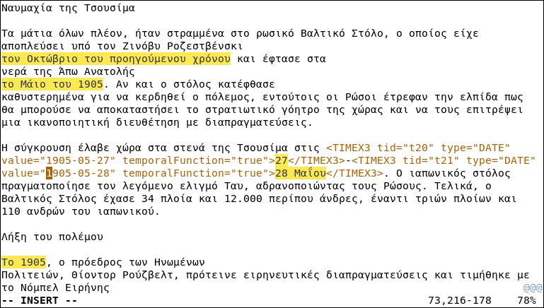

# vim-timex-annotation
Vim scripts to make manual annotation of temporal expressions easier.



### Features
- syntax highlight for tagged expressions
- select text in VISUAL MODE and press `<I>`, `<D>` for `<TIMEX3 type="DATE">`
- select text in VISUAL MODE and press `<I>`, `<T>` for `<TIMEX3 type"TIME">`
- select text in VISUAL MODE and press `<I>`, `<U>` for `<TIMEX3 type"DURATION">`
- saves last tid value and increments it by 1 on new annotation
- while in INSERT MODE you can `<SPACE>`, `<SPACE>` to jump to next attribute value

### Installation
1. place vim contents into your ~/.vim folder
2. add the following to your ~/.vimrc
```vim
set nocompatible 
set linebreak
syntax enable
source ~/.vim/timeml-annotation.vim
```
